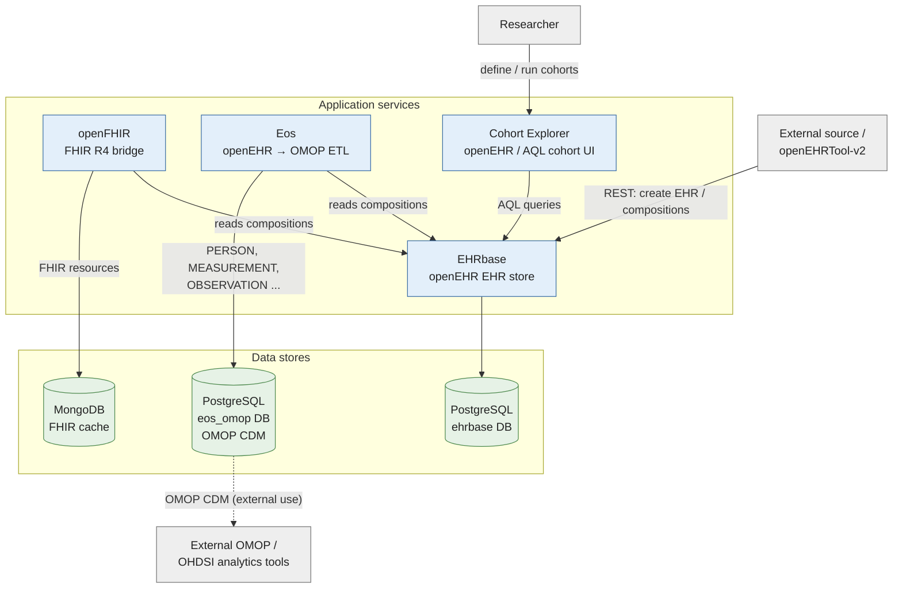

# Open Health Stack (OHS)

A Kubernetes-native Helm umbrella chart that deploys a unified health data platform - combining openEHR EHR storage, FHIR interoperability, OMOP CDM analytics, identity management, and export tooling - using Helm with minimal changes to upstream projects.

## Components

| Component                      | Role                                    | Status         | Image                                                                               |
| ------------------------------ | --------------------------------------- | -------------- | ----------------------------------------------------------------------------------- |
| **EHRbase**                    | EHR storage (openEHR / ISO 13606)       | Active         | `ehrbase/ehrbase:2.31.0`                                                            |
| **openFHIR**                   | FHIR R4 server and openEHR bridge       | Active         | `openfhir/openfhir:2.2.1`                                                           |
| **Eos**                        | ETL from openEHR to OMOP CDM            | Active         | `ghcr.io/SevKohler/Eos:latest`                                                      |
| **EHRsuction**                 | openEHR composition export job          | Active         | `localhost:5000/ehrsuction:ohs`                                                     |
| **openEHRTool-v2**             | Web UI for EHR editing (Vue3 + FastAPI) | Active         | `localhost:5000/openehrtool-backend:ohs`, `localhost:5000/openehrtool-frontend:ohs` |
| **Cohort Explorer**            | openEHR / AQL cohort query UI (NUM num-portal) | Active  | self-built local images                                                             |
| **Keycloak**                   | Identity and access management          | Active         | `quay.io/keycloak/keycloak:24.0`                                                    |
| **CloudNativePG**              | PostgreSQL operator                     | Active         | `1.21.0`                                                                            |
| **MongoDB Community Operator** | MongoDB operator                        | Active         | `0.8.0`                                                                             |
| **CSV-to-openEHR**             | Bulk import from CSV                    | Placeholder    |                                                                                     |

## Architecture

How data flows through the stack - captured as openEHR in EHRbase, then bridged to
FHIR (openFHIR) and transformed to the OMOP CDM (Eos) for analytics:



The Kubernetes deployment view and the full end-to-end data flow are in
[docs/diagrams/](docs/diagrams/) (editable [`architecture.drawio`](docs/diagrams/architecture.drawio)
plus a Mermaid source). See [ARCHITECTURE.md](docs/ARCHITECTURE.md) for design decisions.

## Quick Start

See [GETTING_STARTED.md](docs/GETTING_STARTED.md) for the full guide, including operator pre-installation, local image builds, and Docker Desktop setup.

> **Prerequisite:** The CloudNativePG and MongoDB Community operators must be installed
> cluster-wide *before* deploying OHS. See [DEPLOYMENT.md](docs/DEPLOYMENT.md#step-2-install-the-required-operators).

> **Heads up:** openEHRTool-v2, EHRsuction, and Cohort Explorer have no published images at this time
> and **must be built from source** (`scripts/build-images.sh`) before `helm install`, or
> those pods will fail to pull. The build step is included below.

Standard Kubernetes deployment (custom registry):

```bash
kubectl create namespace ohs --dry-run=client -o yaml | kubectl apply -f -
kubectl label namespace ohs name=ohs --overwrite

cp .env.example .env
# Fill in your local or deployment-specific passwords.

bash scripts/create-secret.sh

# Build and push the self-hosted images, then point values.yaml at your registry.
OPENEHRTOOL_BACKEND_HOSTNAME=openehrtool-api.example.org \
  bash scripts/build-images.sh --registry registry.example.org/ohs

helm upgrade --install ohs . -n ohs -f values.yaml

kubectl get pods -n ohs -w
```

Local deployment:

```bash
cp .env.example .env
# Fill in your local passwords.

bash scripts/create-secret.sh

# Build local images required by components without published images.
# Docker Desktop shares the host Docker daemon - no registry push needed.
OPENEHRTOOL_BACKEND_HOSTNAME=localhost \
  bash scripts/build-images.sh --registry localhost:5000 --skip-push

helm upgrade --install ohs . -n ohs -f values.yaml -f values-local.yaml --timeout 15m

kubectl get pods -n ohs -w
```

Once pods are running, forward all service ports to localhost with a single command:

```bash
bash scripts/port-forward.sh
```

## Documentation

| File                                     | Contents                                                                   |
| ---------------------------------------- | -------------------------------------------------------------------------- |
| [GETTING_STARTED.md](docs/GETTING_STARTED.md) | Quick start, local setup, image builds, port-forwarding, common operations |
| [DEPLOYMENT.md](docs/DEPLOYMENT.md)           | Full deployment guide and production notes                                 |
| [VERIFICATION.md](docs/VERIFICATION.md)       | Health checks and end-to-end testing workflow                              |
| [ARCHITECTURE.md](docs/ARCHITECTURE.md)       | Component overview, data flows, and design decisions                       |
| [SECRETS.md](docs/SECRETS.md)                 | Secret management with kubectl, Sealed Secrets, ESO, and SOPS              |
| [VALUES.md](docs/VALUES.md)                   | Helm values reference                                                      |
| [NEXT_STEPS.md](docs/NEXT_STEPS.md)           | Roadmap and future phases                                                  |
| [REQUIREMENTS.md](docs/REQUIREMENTS.md)       | Original requirements and architectural constraints                        |

## Project Structure

```text
ohs/
├── Chart.yaml                    # Umbrella chart
├── values.yaml                   # Base configuration
├── values-local.yaml             # Local Docker Desktop overrides
├── scripts/
│   ├── create-secret.sh          # Creates required Kubernetes secrets from .env
│   ├── build-images.sh           # Builds self-hosted component images from source
│   ├── load-vocab.sh             # Loads OMOP Athena vocabularies into the eos_omop DB
│   └── port-forward.sh           # Forwards all OHS service ports to localhost
├── charts/                       # Subcharts
├── templates/
│   ├── ingress.yaml
│   ├── rbac.yaml
│   ├── networkpolicy.yaml
│   ├── servicemonitor.yaml
│   ├── poddisruptionbudget.yaml
│   ├── ehrsuction/
│   │   ├── cronjob.yaml          # EHRsuction export CronJob
│   │   └── pvc.yaml              # Persistent export volume
│   └── databases/
│       ├── postgres-cluster.yaml # CloudNativePG Cluster CRD
│       └── mongodb-cluster.yaml  # MongoDB Community CRD
└── docs/
```

## Local Image Builds

openEHRTool-v2, EHRsuction, and Cohort Explorer have no suitable published images and are built from source with `scripts/build-images.sh`. Build all at once:

```bash
OPENEHRTOOL_BACKEND_HOSTNAME=localhost \
  bash scripts/build-images.sh --registry localhost:5000 --skip-push
```

See [GETTING_STARTED.md](docs/GETTING_STARTED.md) for per-component builds and the `OPENEHRTOOL_BACKEND_HOSTNAME` details.

## EHRsuction Export Job

EHRsuction is deployed as a Kubernetes CronJob.

Run a manual export:

```bash
JOB="ohs-ehrsuction-manual-$(date +%s)"

kubectl create job -n ohs "$JOB" --from=cronjob/ohs-ehrsuction

sleep 3
kubectl logs -n ohs -f job/"$JOB"
```

Exported files are written to the `ohs-ehrsuction-export` PVC.

## Key Notes

* **Operators must be pre-installed**: CloudNativePG and MongoDB Community Operator are required before installing the chart.
* **Secrets are externalized**: copy `.env.example` to `.env`, fill in values, and run `scripts/create-secret.sh`.
* **Local Docker Desktop uses `values-local.yaml`**: this profile reduces database replicas, disables selected probes, and uses locally built images.
* **Eos runs on port `8081`**: probes and service `targetPort` are configured accordingly.
* **Eos needs OMOP vocabularies**: load Athena vocabularies into the `eos_omop` DB once with `scripts/load-vocab.sh`, then restart the Eos pod. Without them, concept mapping is skipped.
* **EHRsuction runs as a CronJob**: exports are written to a persistent volume and can be triggered manually or by schedule.
* **openEHRTool-v2, EHRsuction and Cohort Explorer require local/self-hosted image builds**: use `scripts/build-images.sh`.
* **Cohort Explorer and Keycloak are enabled in the local profile**: configure image coordinates, domains, and secrets before deploying on standard Kubernetes.
* **PostgreSQL and MongoDB data are persistent**: verify hook policies, storage classes, backup configuration, and deletion behavior before production use.
