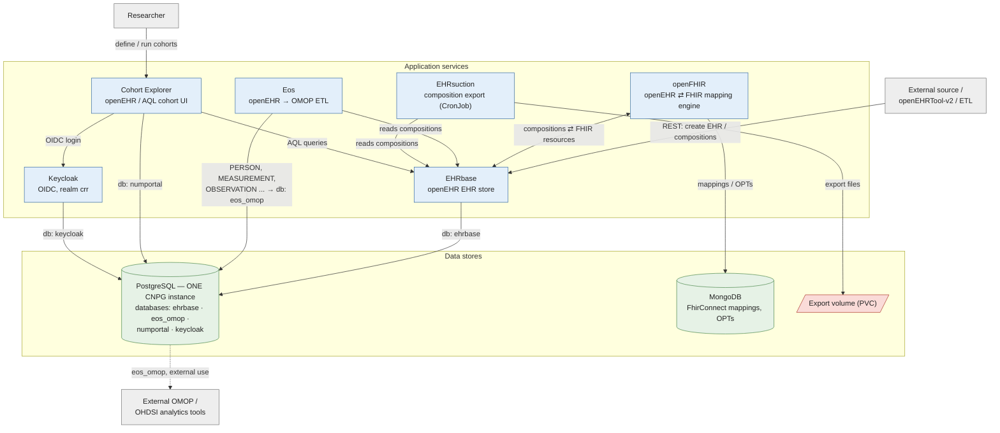

# Open Health Stack (OHS)

A Kubernetes-native Helm umbrella chart that deploys a unified health data platform - combining openEHR EHR storage, FHIR interoperability, OMOP CDM analytics, identity management, and export tooling - using Helm with minimal changes to upstream projects.

## Components

| Component                      | Role                                    | Status         | Image                                                                               |
| ------------------------------ | --------------------------------------- | -------------- | ----------------------------------------------------------------------------------- |
| **EHRbase**                    | EHR storage (openEHR / ISO 13606)       | Active         | `ehrbase/ehrbase:2.31.0`                                                            |
| **openFHIR**                   | FHIR R4 server and openEHR bridge       | Active         | `openfhir/openfhir:2.2.1`                                                           |
| **Eos**                        | ETL from openEHR to OMOP CDM            | Active         | `ghcr.io/SevKohler/Eos:latest`                                                      |
| **EHRsuction**                 | openEHR composition export job          | Active         | `localhost:5000/ehrsuction:ohs`                                                     |
| **openEHRTool-v2**             | Web UI for EHR editing (Vue3 + FastAPI) | Active         | `localhost:5000/openehrtool-backend:ohs`, `localhost:5000/openehrtool-frontend:ohs` |
| **Cohort Explorer**            | openEHR / AQL cohort query UI (NUM num-portal) | Active  | self-built local images                                                             |
| **Keycloak**                   | Identity and access management          | Active         | `quay.io/keycloak/keycloak:24.0`                                                    |
| **CloudNativePG**              | PostgreSQL operator                     | Active         | `1.21.0`                                                                            |
| **MongoDB Community Operator** | MongoDB operator                        | Active         | `0.8.0`                                                                             |

## Architecture

How data flows through the stack - captured as openEHR in EHRbase, then bridged to
FHIR (openFHIR) and transformed to the OMOP CDM (Eos) for analytics:


```mermaid
flowchart TB
    src["External source /<br/>openEHRTool-v2 / ETL"]:::ext

    subgraph apps["Application services"]
        ehrbase["EHRbase<br/>openEHR EHR store"]:::app
        openfhir["openFHIR<br/>openEHR ⇄ FHIR mapping engine"]:::app
        eos["Eos<br/>openEHR → OMOP ETL"]:::app
        ehrsuction["EHRsuction<br/>composition export (CronJob)"]:::app
        cohort["Cohort Explorer<br/>openEHR / AQL cohort UI"]:::app
        keycloak["Keycloak<br/>OIDC, realm crr"]:::app
    end

    subgraph data["Data stores"]
        pg[("PostgreSQL — ONE CNPG instance<br/>databases: ehrbase · eos_omop ·<br/>numportal · keycloak")]:::db
        mongo[("MongoDB<br/>FhirConnect mappings, OPTs")]:::db
        exportvol[/"Export volume (PVC)"/]:::secret
    end

    analyst["Researcher"]:::ext
    omoptools["External OMOP /<br/>OHDSI analytics tools"]:::ext

    src -->|"REST: create EHR / compositions"| ehrbase
    ehrbase -->|"db: ehrbase"| pg
    openfhir <-->|"compositions ⇄ FHIR resources"| ehrbase
    openfhir -->|"mappings / OPTs"| mongo
    eos -->|"reads compositions"| ehrbase
    eos -->|"PERSON, MEASUREMENT,<br/>OBSERVATION ... → db: eos_omop"| pg
    ehrsuction -->|"reads compositions"| ehrbase
    ehrsuction -->|"export files"| exportvol
    cohort -->|"AQL queries"| ehrbase
    cohort -->|"db: numportal"| pg
    cohort -->|"OIDC login"| keycloak
    keycloak -->|"db: keycloak"| pg
    analyst -->|"define / run cohorts"| cohort
    pg -.->|"eos_omop, external use"| omoptools

    classDef ext fill:#eeeeee,stroke:#777777,color:#222;
    classDef app fill:#e3effa,stroke:#3b6ea5,color:#222;
    classDef db  fill:#e6f2e6,stroke:#4f8a4f,color:#222;
    classDef secret fill:#fadbd8,stroke:#b03a2e,color:#222;
```

Note the single PostgreSQL: EHRbase, Eos, the Cohort Explorer backend and Keycloak
share **one** CNPG instance and differ only in the database they open. It is one
volume and one failure domain for all four. openFHIR is a mapping engine, not a FHIR
store: MongoDB holds its FhirConnect mappings and templates, not patient data.

The Kubernetes deployment view and the full end-to-end data flow are
in [docs/diagrams/](docs/diagrams/) (editable
[`architecture.drawio`](docs/diagrams/architecture.drawio) plus a Mermaid source).
See [ARCHITECTURE.md](docs/ARCHITECTURE.md) for design decisions.

## Quick Start

See [GETTING_STARTED.md](docs/GETTING_STARTED.md) for the full guide, including operator pre-installation, local image builds, and Docker Desktop setup.

> **Prerequisite:** The CloudNativePG and MongoDB Community operators must be installed
> cluster-wide *before* deploying OHS. See [DEPLOYMENT.md](docs/DEPLOYMENT.md#step-2-install-the-required-operators).

> **Heads up:** openEHRTool-v2, EHRsuction, and Cohort Explorer have no published images at this time
> and **must be built from source** (`scripts/build-images.sh`) before `helm install`, or
> those pods will fail to pull. The build step is included below.

Standard Kubernetes deployment (custom registry):

```bash
kubectl create namespace ohs --dry-run=client -o yaml | kubectl apply -f -
kubectl label namespace ohs name=ohs --overwrite

cp .env.example .env
# Fill in your local or deployment-specific passwords.

bash scripts/create-secret.sh

# Build and push the self-hosted images, then point values.yaml at your registry.
OPENEHRTOOL_BACKEND_HOSTNAME=openehrtool-api.example.org \
  bash scripts/build-images.sh --registry registry.example.org/ohs

helm upgrade --install ohs . -n ohs -f values.yaml

kubectl get pods -n ohs -w
```

Local deployment (Docker Desktop) - one command from a fresh clone:

```bash
bash scripts/local-up.sh
```

It checks the prerequisites, installs both database operators, creates the namespace,
generates a `.env` with random credentials, builds the images that have no published
artefact, deploys the chart, waits for the workloads, and loads the Athena vocabulary if
`vocab/` is present. Every phase skips work that is already done, so it is safe to re-run.
Useful flags: `--skip-images`, `--rebuild-images`, `--skip-vocab`, `--full-vocab`,
`-n NAME`, `-y`. It refuses any kube-context other than `docker-desktop` unless you pass
`--context NAME`.

The same steps by hand, for a cluster that is not Docker Desktop:

```bash
cp .env.example .env
# Fill in your local passwords.

bash scripts/create-secret.sh

# Build local images required by components without published images.
# Docker Desktop shares the host Docker daemon - no registry push needed.
OPENEHRTOOL_BACKEND_HOSTNAME=localhost   bash scripts/build-images.sh --registry localhost:5000 --skip-push

helm upgrade --install ohs . -n ohs -f values.yaml -f values-local.yaml --timeout 15m

kubectl get pods -n ohs -w
```

Once pods are running, forward all service ports to localhost:

```bash
bash scripts/port-forward.sh
```

### Browser test console

`docs/test-ui/` walks the whole chain in a browser - create an EHR, upload the template,
store a composition, run the Eos transformation into OMOP, get a Keycloak token, query the
Cohort Explorer, convert the composition to FHIR. "Run all steps" executes the sequence and
a live pipeline shows how far the data got.

```bash
bash scripts/port-forward.sh          # terminal 1
python scripts/test-ui-proxy.py       # terminal 2 -> http://localhost:8888/test-ui/
```

Start it through that proxy, not a plain file server: the page is subject to CORS, and of
these services only EHRbase and Keycloak send CORS headers. The proxy serves the page and
forwards `/svc/<name>` to each port-forward, so everything shares one origin and CORS never
applies. Behind the ingress this is moot - one origin already.

## Documentation

| File                                     | Contents                                                                   |
| ---------------------------------------- | -------------------------------------------------------------------------- |
| [GETTING_STARTED.md](docs/GETTING_STARTED.md) | Quick start, local setup, image builds, port-forwarding, common operations |
| [DEPLOYMENT.md](docs/DEPLOYMENT.md)           | Full deployment guide and production notes                                 |
| [VERIFICATION.md](docs/VERIFICATION.md)       | Health checks and end-to-end testing workflow                              |
| [test-ui/](docs/test-ui/)                     | Browser console that walks the end-to-end chain (serve with `scripts/test-ui-proxy.py`) |
| [ARCHITECTURE.md](docs/ARCHITECTURE.md)       | Component overview, data flows, and design decisions                       |
| [SECRETS.md](docs/SECRETS.md)                 | Secret management with kubectl, Sealed Secrets, ESO, and SOPS              |
| [VALUES.md](docs/VALUES.md)                   | Helm values reference                                                      |
| [REQUIREMENTS.md](docs/REQUIREMENTS.md)       | Original requirements and architectural constraints                        |

## Project Structure

```text
ohs/
├── Chart.yaml                    # Umbrella chart
├── values.yaml                   # Base configuration
├── values-local.yaml             # Local Docker Desktop overrides
├── scripts/
│   ├── local-up.sh               # One-command Docker Desktop bring-up (calls the rest)
│   ├── create-secret.sh          # Creates required Kubernetes secrets from .env
│   ├── build-images.sh           # Builds self-hosted component images from source
│   ├── load-vocab.sh             # Loads OMOP Athena vocabularies into the eos_omop DB
│   ├── port-forward.sh           # Forwards all OHS service ports to localhost
│   ├── test-ui-proxy.py          # Serves docs/test-ui on one origin with the services
│   ├── ehrbase-index.sh          # Index maintenance for the EHRbase database
│   ├── aql-explain.sh            # Query plans and timings for stored AQL
│   ├── aql-analyze.sh            # Analyses the AQL criteria catalogue
│   └── seed-aql-criteria.sh      # Seeds the cohort builder's AQL criteria
├── charts/                       # Subcharts
├── templates/
│   ├── ingress.yaml
│   ├── rbac.yaml
│   ├── networkpolicy.yaml
│   ├── servicemonitor.yaml
│   ├── poddisruptionbudget.yaml
│   ├── ehrsuction/
│   │   ├── cronjob.yaml          # EHRsuction export CronJob
│   │   └── pvc.yaml              # Persistent export volume
│   └── databases/
│       ├── postgres-cluster.yaml # CloudNativePG Cluster CRD
│       └── mongodb-cluster.yaml  # MongoDB Community CRD
└── docs/
```

## Local Image Builds

openEHRTool-v2, EHRsuction, and Cohort Explorer have no suitable published images and are built from source with `scripts/build-images.sh`. Build all at once:

```bash
OPENEHRTOOL_BACKEND_HOSTNAME=localhost \
  bash scripts/build-images.sh --registry localhost:5000 --skip-push
```

See [GETTING_STARTED.md](docs/GETTING_STARTED.md) for per-component builds and the `OPENEHRTOOL_BACKEND_HOSTNAME` details.

## EHRsuction Export Job

EHRsuction is deployed as a Kubernetes CronJob.

Run a manual export:

```bash
JOB="ohs-ehrsuction-manual-$(date +%s)"

kubectl create job -n ohs "$JOB" --from=cronjob/ohs-ehrsuction

sleep 3
kubectl logs -n ohs -f job/"$JOB"
```

Exported files are written to the `ohs-ehrsuction-export` PVC.

## Key Notes

* **Operators must be pre-installed**: CloudNativePG and MongoDB Community Operator are required before installing the chart.
* **Secrets are externalized**: copy `.env.example` to `.env`, fill in values, and run `scripts/create-secret.sh`.
* **Local Docker Desktop uses `values-local.yaml`**: this profile reduces database replicas, disables selected probes, and uses locally built images.
* **Eos runs on port `8081`**: probes and service `targetPort` are configured accordingly.
* **Eos needs OMOP vocabularies - a hard prerequisite, not an enhancement**: load them into the `eos_omop` DB once with `scripts/load-vocab.sh` (`local-up.sh` does it for you), then restart the Eos pod. Without them `POST /person` does not merely skip concept mapping, it fails outright with HTTP 500 `TransientPropertyValueException: Person.genderConcept` - the person mapping falls back to concept id `0`, and that row exists only once `CONCEPT.csv` is loaded. The five core tables suffice; the four large ones matter only for drug resolution.
* **EHRsuction runs as a CronJob**: exports are written to a persistent volume and can be triggered manually or by schedule.
* **openEHRTool-v2, EHRsuction and Cohort Explorer require local/self-hosted image builds**: use `scripts/build-images.sh`.
* **Cohort Explorer and Keycloak are enabled in the local profile**: configure image coordinates, domains, and secrets before deploying on standard Kubernetes.
* **PostgreSQL and MongoDB data are persistent**: verify hook policies, storage classes, backup configuration, and deletion behavior before production use.
