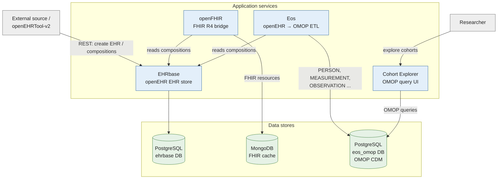
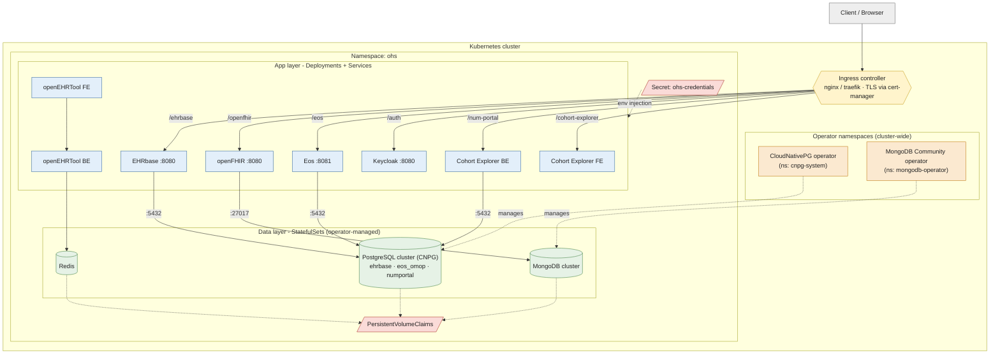
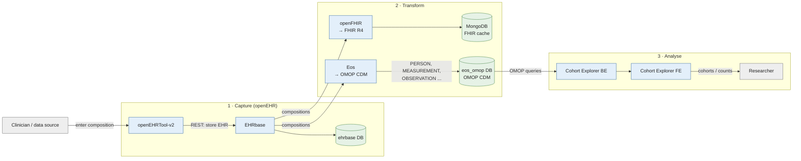

# OHS Architecture Diagrams (Mermaid)

Diagram-as-code companions to the polished [`architecture.drawio`](architecture.drawio)
file. Three views:

1. **Logical / component view** - what the services are and how data moves between them.
2. **Kubernetes deployment view** - how the stack runs in the cluster.
3. **End-to-end data flow** - the path of a single record from ingestion to analytics.

> Renders directly in GitHub, the VS Code Mermaid preview, and most Markdown
> toolchains. For a print-quality figure, export the draw.io version to SVG/PDF.

Shared palette (used across all three diagrams):

| Role | Fill / stroke |
|------|---------------|
| Application service | `#e3effa` / `#3b6ea5` (blue) |
| Stateful data store | `#e6f2e6` / `#4f8a4f` (green) |
| Operator (cluster-wide) | `#fbe9d0` / `#c47f1a` (amber) |
| Ingress / entrypoint | `#fff4cc` / `#c9a227` (gold) |
| Secret / PVC | `#fadbd8` / `#b03a2e` (red) |
| External / client | `#eeeeee` / `#777777` (grey) |

---

## Logical / Component view + primary data flow

---

## Kubernetes deployment view

---

## End-to-end data flow (single record)

Traces one clinical record from ingestion through to the analytics UI, crossing
the three data models the stack bridges: **openEHR → FHIR / OMOP CDM → cohort**.

