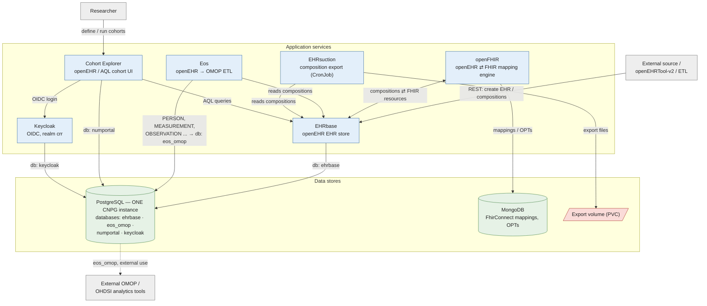
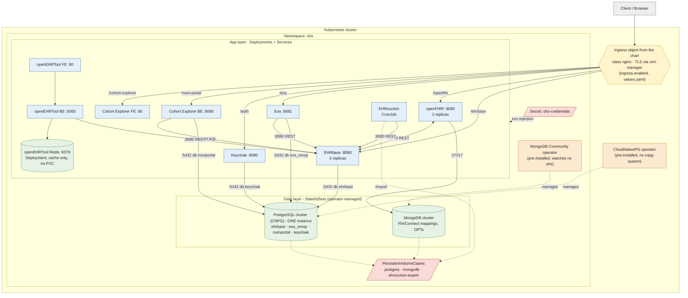
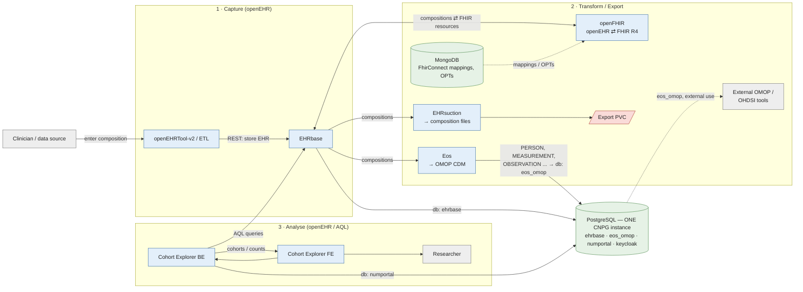

# OHS Architecture Diagrams (Mermaid)

**This file is the maintained source.** The [`architecture.drawio`](architecture.drawio)
next to it is out of date (two PostgreSQL cylinders, no Keycloak, nginx ingress) and
should be redrawn from these views before it goes into a report. Three views:

1. **Logical / component view** - what the services are and how data moves between them.
2. **Kubernetes deployment view** - how the stack runs in the cluster, as the chart ships it.
3. **End-to-end data flow** - the path of a single record from ingestion to analytics.

> Renders directly in GitHub, the VS Code Mermaid preview, and most Markdown
> toolchains. For a print-quality figure, export the draw.io version to SVG/PDF
> once it has been brought up to date.

Shared palette (used across all diagrams):

| Role | Fill / stroke |
|------|---------------|
| Application service | `#e3effa` / `#3b6ea5` (blue) |
| Stateful data store | `#e6f2e6` / `#4f8a4f` (green) |
| Operator (cluster-wide) | `#fbe9d0` / `#c47f1a` (amber) |
| Ingress / entrypoint | `#fff4cc` / `#c9a227` (gold) |
| Secret / PVC | `#fadbd8` / `#b03a2e` (red) |
| External / client | `#eeeeee` / `#777777` (grey) |

**One PostgreSQL, four databases.** EHRbase, Eos, the Cohort Explorer backend and
Keycloak all point at `postgres-cluster-rw.ohs.svc.cluster.local` and differ only in
the database they open (`values.yaml`, line 48: *"keycloak, numportal and eos_omop
share the instance"*). Earlier revisions of these diagrams drew two PostgreSQL
cylinders, which hid the coupling: when that one volume filled up during a bulk load,
every service on it went down together, not just EHRbase.

**openFHIR is a mapping engine, not a FHIR store.** It converts openEHR compositions to
FHIR resources and back (`/openfhir/tofhir`, `/openfhir/toopenehr`, see
`VERIFICATION.md`). MongoDB holds its FhirConnect model mappings and operational
templates, not patient data. Earlier revisions labelled MongoDB a "FHIR cache".

---

## Logical / Component view + primary data flow

*Arrows point from caller to callee - who initiates the request.*

```mermaid
flowchart TB
    src["External source /<br/>openEHRTool-v2 / ETL"]:::ext

    subgraph apps["Application services"]
        ehrbase["EHRbase<br/>openEHR EHR store"]:::app
        openfhir["openFHIR<br/>openEHR ⇄ FHIR mapping engine"]:::app
        eos["Eos<br/>openEHR → OMOP ETL"]:::app
        ehrsuction["EHRsuction<br/>composition export (CronJob)"]:::app
        cohort["Cohort Explorer<br/>openEHR / AQL cohort UI"]:::app
        keycloak["Keycloak<br/>OIDC, realm crr"]:::app
    end

    subgraph data["Data stores"]
        pg[("PostgreSQL — ONE CNPG instance<br/>databases: ehrbase · eos_omop ·<br/>numportal · keycloak")]:::db
        mongo[("MongoDB<br/>FhirConnect mappings, OPTs")]:::db
        exportvol[/"Export volume (PVC)"/]:::secret
    end

    analyst["Researcher"]:::ext
    omoptools["External OMOP /<br/>OHDSI analytics tools"]:::ext

    src -->|"REST: create EHR / compositions"| ehrbase
    ehrbase -->|"db: ehrbase"| pg
    openfhir <-->|"compositions ⇄ FHIR resources"| ehrbase
    openfhir -->|"mappings / OPTs"| mongo
    eos -->|"reads compositions"| ehrbase
    eos -->|"PERSON, MEASUREMENT,<br/>OBSERVATION ... → db: eos_omop"| pg
    ehrsuction -->|"reads compositions"| ehrbase
    ehrsuction -->|"export files"| exportvol
    cohort -->|"AQL queries"| ehrbase
    cohort -->|"db: numportal"| pg
    cohort -->|"OIDC login"| keycloak
    keycloak -->|"db: keycloak"| pg
    analyst -->|"define / run cohorts"| cohort
    pg -.->|"eos_omop, external use"| omoptools

    classDef ext fill:#eeeeee,stroke:#777777,color:#222;
    classDef app fill:#e3effa,stroke:#3b6ea5,color:#222;
    classDef db  fill:#e6f2e6,stroke:#4f8a4f,color:#222;
    classDef secret fill:#fadbd8,stroke:#b03a2e,color:#222;
```

---

## Kubernetes deployment view

As the **chart** ships it: the built-in Ingress object with the path list from
`values.yaml`.

The two operators are **not** part of the chart (the `cloudnative-pg` and
`mongodb-operator` subcharts carry no templates); they are installed beforehand.
`DEPLOYMENT.md` puts the MongoDB operator in its own namespace `mongodb-operator`.

```mermaid
flowchart TB
    client["Client / Browser"]:::ext

    subgraph cluster["Kubernetes cluster"]
        direction TB

        cnpg["CloudNativePG operator<br/>(pre-installed, ns cnpg-system)"]:::op

        ingress{{"Ingress object from the chart<br/>class nginx · TLS via cert-manager<br/>(ingress.enabled, values.yaml)"}}:::ingress

        subgraph ns["Namespace: ohs"]
            direction TB

            mongoop["MongoDB Community operator<br/>(pre-installed, watches ns ohs)"]:::op

            subgraph applayer["App layer - Deployments + Services"]
                ehrbase["EHRbase :8080<br/>2 replicas"]:::app
                openfhir["openFHIR :8080<br/>2 replicas"]:::app
                eos["Eos :8081"]:::app
                keycloak["Keycloak :8080"]:::app
                ce_fe["Cohort Explorer FE :80"]:::app
                ce_be["Cohort Explorer BE :8090"]:::app
                tool_fe["openEHRTool FE :80"]:::app
                tool_be["openEHRTool BE :5000"]:::app
                redis[("openEHRTool Redis :6379<br/>Deployment, cache only, no PVC")]:::db
                ehrsuction["EHRsuction<br/>CronJob"]:::app
            end

            subgraph datalayer["Data layer - StatefulSets (operator-managed)"]
                pg[("PostgreSQL cluster (CNPG) - ONE instance<br/>ehrbase · eos_omop · numportal · keycloak")]:::db
                mongo[("MongoDB cluster<br/>FhirConnect mappings, OPTs")]:::db
            end

            secret[/"Secret: ohs-credentials"/]:::secret
            pvc[/"PersistentVolumeClaims<br/>postgres · mongodb · ehrsuction-export"/]:::secret
        end
    end

    client --> ingress

    ingress -->|"/ehrbase"| ehrbase
    ingress -->|"/openfhir"| openfhir
    ingress -->|"/eos"| eos
    ingress -->|"/auth"| keycloak
    ingress -->|"/num-portal"| ce_be
    ingress -->|"/cohort-explorer"| ce_fe

    ehrbase -->|":5432 db ehrbase"| pg
    eos -->|":5432 db eos_omop"| pg
    ce_be -->|":5432 db numportal"| pg
    keycloak -->|":5432 db keycloak"| pg
    openfhir -->|":27017"| mongo
    openfhir <-->|":8080 REST"| ehrbase
    eos -->|":8080 REST"| ehrbase
    ehrsuction -->|":8080 REST"| ehrbase
    ce_be -->|":8080 AQL"| ehrbase
    tool_be -->|":8080 REST"| ehrbase
    tool_be --> redis
    tool_fe --> tool_be

    cnpg -.->|manages| pg
    mongoop -.->|manages| mongo
    pg -.-> pvc
    mongo -.-> pvc
    ehrsuction -.->|"/export"| pvc
    secret -.->|env injection| applayer

    classDef ext fill:#eeeeee,stroke:#777777,color:#222;
    classDef app fill:#e3effa,stroke:#3b6ea5,color:#222;
    classDef db  fill:#e6f2e6,stroke:#4f8a4f,color:#222;
    classDef op  fill:#fbe9d0,stroke:#c47f1a,color:#222;
    classDef ingress fill:#fff4cc,stroke:#c9a227,color:#222;
    classDef secret fill:#fadbd8,stroke:#b03a2e,color:#222;

    %% solid arrow  = request / data flow (label = ingress path or port)
    %% dashed arrow = "managed by" / mounts (operator → CRD, store → PVC, Secret → pods)
```

Local installs (`values-local.yaml`) set `ingress.enabled: false` - there is no
entrypoint at all, services are reached with `kubectl port-forward`. The paths above
therefore exist in **neither** deployment as drawn; they are the chart's default for
the placeholder host `ohs.example.org`.

---

## End-to-end data flow (single record)

Traces one clinical record from ingestion to use. openEHR in EHRbase is the hub:
the **Cohort Explorer** queries it directly via AQL, **Eos** (OMOP CDM) produces a
parallel representation for external analytics, **openFHIR** converts compositions to
FHIR resources on request (and FHIR back to openEHR), and **EHRsuction** exports raw
compositions to a volume.

*Arrows follow the data here, not the caller - Eos, EHRsuction and openFHIR pull from
EHRbase.*

```mermaid
flowchart LR
    user["Clinician / data source"]:::ext

    subgraph capture["1 · Capture (openEHR)"]
        tool["openEHRTool-v2 / ETL"]:::app
        ehrbase["EHRbase"]:::app
    end

    subgraph export["2 · Transform / Export"]
        openfhir["openFHIR<br/>openEHR ⇄ FHIR R4"]:::app
        eos["Eos<br/>→ OMOP CDM"]:::app
        ehrsuction["EHRsuction<br/>→ composition files"]:::app
        mongo[("MongoDB<br/>FhirConnect mappings, OPTs")]:::db
        exportvol[/"Export PVC"/]:::secret
        omoptools["External OMOP /<br/>OHDSI tools"]:::ext
    end

    subgraph analyse["3 · Analyse (openEHR / AQL)"]
        ce_be["Cohort Explorer BE"]:::app
        ce_fe["Cohort Explorer FE"]:::app
        analyst["Researcher"]:::ext
    end

    pg[("PostgreSQL — ONE CNPG instance<br/>ehrbase · eos_omop · numportal · keycloak")]:::db

    user -->|"enter composition"| tool
    tool -->|"REST: store EHR"| ehrbase
    ehrbase -->|"db: ehrbase"| pg

    ehrbase <-->|"compositions ⇄ FHIR resources"| openfhir
    ehrbase -->|"compositions"| eos
    ehrbase -->|"compositions"| ehrsuction
    mongo -.->|"mappings / OPTs"| openfhir
    eos -->|"PERSON, MEASUREMENT,<br/>OBSERVATION ... → db: eos_omop"| pg
    ehrsuction --> exportvol
    pg -.->|"eos_omop, external use"| omoptools

    ce_be -->|"AQL queries"| ehrbase
    ce_be -->|"db: numportal"| pg
    ce_fe --> ce_be
    ce_be -->|"cohorts / counts"| ce_fe
    ce_fe --> analyst

    classDef ext fill:#eeeeee,stroke:#777777,color:#222;
    classDef app fill:#e3effa,stroke:#3b6ea5,color:#222;
    classDef db  fill:#e6f2e6,stroke:#4f8a4f,color:#222;
    classDef secret fill:#fadbd8,stroke:#b03a2e,color:#222;
```
